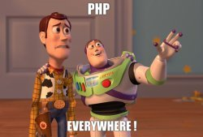
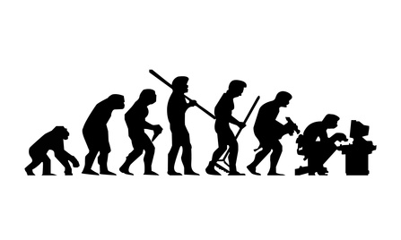
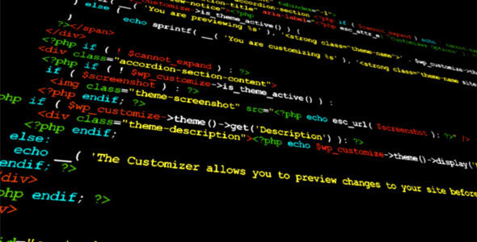

= De PHP Moche à aujourd'hui
:source-highlighter: highlightjs

== Pourquoi cette présentation ?

=== "Le PHP c'est pas un vrai langage"

* C'est pas stable
* C'est sale
* "Nan, mais les types ils essayent de faire de l'object"
* Vous faites des tests en vrai ?
* Etc.

=== ...

== Alors que ...

* 80% du web
* Wordpress = 25% du web
* Taux de pénétration de 57% dans les entreprises (source wikipedia, désolé)

[.notes]
--
Enfin en 2010, PHP est le langage dont les logiciels open source sont les plus utilisés dans les entreprises, avec 57 % de taux de pénétration.

http://news.cnet.com/8301-13505_3-10453213-16.html

Punchlines :
Et pourtant j'aime pas Wordpress
Quoi que vous puissiez dire, PHP c'est 80%
--

== Reprenons depuis le début

L'histoire de PHP

=== 1994 : PHP/FI

Création par Rasmus Lerdorf de PHP/FI (*Personal Home Page Tools*)

Objectif : réutiliser du code

----
<!--include /text/header.html-->

<!--getenv HTTP_USER_AGENT-->
<!--ifsubstr $exec_result Mozilla-->
  Hé, vous utilisez Netscape !

<!--endif-->

<!--sql database select * from table where user='$username'-->
<!--ifless $numentries 1-->
  Désolé, cette ligne n'existe pas

<!--endif exit-->
  Bienvenue <!--$user--> !

  Vous avez <!--$index:0--> crédits sur votre compte.

<!--include /text/footer.html-->
----

[.notes]
--
A l'orgine, c'était juste pour éviter de repeter du code, pas du tout pour être un langage de programmation.
C'était juste un outil de type CGI, pour générer un peu de contenu, pas un langage à proprement parlé.

Punchlines :
Regardez comme c'est moche
--

=== 1996 : PHP/FI v2

* Refonte complète
* Gestion des cookies
* Gestion de la connexion avec certaines DB

* 60 000 domaines internet (source Netcraft)
* Soit 1% du web de l'époque

[.notes]
--
Toujours maintenu par un seul gars
Grosse refonte mais limiter by design

Punchlines :
On peut dire qu'au moins 1% d'internet n'était très stable à l'époque
--

=== 1998 : PHP Hypertext Preprocessor, aka PHP3

* Arrivé de Andi Gutmans et Zeev Suraski
* Nouvelle refonte
* Naissance du langage en tant que tel
* Toujours orienté petit site web
* 70.000 domaines
* 10% du web

[.notes]
--
Rien de particulier à dire ici.
PHP continue son bout de chemin
Pas fait pour faire de grosses applications

Punchlines :
L'instabilité d'internet est de plus en plus inquiétante
--

=== mi-1999 : PHP 4

* Le fameux PHP qui fait flipper
* Nouveau moteur "Zend Engine"
* Amélioration des performances
* Beaucoup de connecteurs avec des systèmes externes
* Peu gérer des applications de plus en plus importante

[.notes]
--
Zend : contraction de Zeev et Andi
C'est cette version dont beaucoup de personnes se souviennent et en font encore des cauchemars

Punchlines :
On verra des exemples tout à l'heure ne vous inquietez pas, mais je demanderai aux ames sensibles de sortir avant
--

=== 2004 : PHP 5

* Zend Engine 2.0
* Arrivée de l'objet
* Explosion de la communauté
** PEAR/PECL
** l'AFUP
** Wordpress
** Symfony
** etc.
* 8 millions de sites web (en 2002)

=== 2016 : PHP 7

* On va en parler ...
* ... mais juste, c'est plus rapide que Python

[.notes]
--
PHP6 c'est gauffré, une sombre histoire d'unicode
Je ne vais pas épiloguer
--

=== 2020 : PHP 8

* Encore en beta à l'heure actuelle
* De jolies promesses

== Cassons un peu les à priori

[source,php]
----
<?php
    $result = mysql_query('SELECT * FROM useurs WHERE name="' . $_GET['login'] . '"');
    ?>
<html><head></head>
<body>
    <ul>
    <?php while ($row = mysql_fetch_assoc($result)) { ?>
        <li><?php echo $result['name'] ?></li>
    <?php } ?>
    </ul>
</body>
----

C'est pas très beau hein ?

[.notes]
--
Oui, ça ressemblait à ça avant

Punchlines :
* Wordpress ressemble toujours un peu à ça
* Au moins c'était efficace
* J'ai pas testé le code, trop de faille de sécu
--

== Le PHP dans les fichiers HTML

* Le fameux .phtml

[source,php]
----
<ul>
    <?php foreach ($items as $item) { ?>
        <li><?php echo $item->getName(); ?></li>
    <?php } ?>
</ul>
----

=== Ou pire

* L'accès direct au fichier php
* Pour aller sur http://<mon_site>/mapage.php

.mapage.php
[source,php]
----
<?php
session_start();
?>
<html>
<body>
...
</body>
</html>
----

=== Mais pourquoi ?

* A l'origine, le PHP n'était fait que pour rajouter du contenu dynamique dans un page HTML.
* Pas de point d'entrée unique
* C'était le but (et vous étiez bien content)
* Plus simple pour des non développeurs
* Pas besoin de POO
* Le plus important : PHP était fait pour générer du HTML

[.notes]
--
On se collait à la façon de fonctionner d'apache
Il n'y avait pas/peu de framework fullstack
--

=== Maintenant

* Point d'entrée unique
* Framework fullstack
* Langage de template (Twig)
* Ou simplement backend REST
* Le langage n'est plus fait QUE pour créer du HTML

=== La cas wordpress

* L'irreductible
* Communauté différente
* C'est comme comparer les adeptes de JQuery et les aficionados d'Angular
* Usage originel de PHP

== Le langage

[.notes]
--
Quelques éléments importants sur lesquels on me pose des questions
--

=== Le typage

Ce que vous connaissez

[source,php]
----
<?php

function test($toto = null) {
    return $toto;
}
----

[.notes]
--

* PHP 4 : le typage n'avait aucun sens
* PHP 5 : Possible dans les paramètres et encore que des classes
--

=== Maintenant

[source,php]
----
<?php

declare(strict_types = 1);

class ILovePHP
{
    private string $myVar;

    protected function test(MonInterface? $toto): void
    {
        echo 'Ca change hein ?';
    }
}
----

* Typage fort possible et complet

[.notes]
--
strict_types définissable dans la conf de base
Depuis 7.4, on peut tout typer
On peut toujours travailler sans si on le souhaite
Les scalaires sont supportés
--

=== Les namespaces

* Organisation du code
* Norme PSR-0/PSR-4

[source,php]
----
<?php

namespace Client\MonProjet\Controller;

use Framework\Controller\AbstractContoller;

class HomeController extends AbstractContoller
{
}
----

=== L'autoloader

* Fini les requires/includes etc.
* spl_autoload
* Permet de charger les classes à la volée
* Utilise les namespaces pour trouver les classes
* Standardisé (PSR-0/PSR-4)

=== Les traits

* Palliatif à l'héritage multiple
* Exemple : mes controllers doivent tous pouvoir logger

.LoggerTrait.php
[source,php]
----
<?php

trait Logger
{
    public function warning(): void
    {
        ...
    }
}
----

=== Usage

[source,php]
----
<?php

class MyController {
    use Logger;

    public function __construct(): void
    {
        $this->warning('Je suis vivant !!!');
    }
}
----

=== Les annotations

* Comme dans tous les langages "cools" :)
* Peut prendre la place des fichiers de conf
* Très appréciés par Doctrine, Symfony, etc.

[source,php]
----
/**
 * @Route('/homepage')
 */
public function index(){}

/**
 * @ORM/Column('string', length=255)
 */
protected $name;

----

=== Fonction anonyme

* en direct ou par référence

[source,php]
----
// Direct usage
usort([], function ($a, $b) {
    return $a < $b;
});
----

[source,php]
----
// By ref
$contextVar = null;
$myFunc = function($path) use ($contextVar) {
};
$myFunc("path/to/directoy");
----

=== Les trucs qui manquent

* Enum
* Besoin de définir les getters/setters
* Template/Generics

image::images/cry.jpg[cry,30%]

[.notes]
--
Même si nos IDEs générent les getters/setters automatiquement
--

== La stabilité

=== Ce que j'entend

* PHP, c'est pas stable !
* Ca marche mal
* C'est lent ...
* C'est un langage de Schrodinger

[.notes]
--
Pour les anciens, oui, PHP, ce n'était pas stable
--

=== Les vraies raisons

* display_errors : false
* Pas de compilation
* Langage permissif
* Communauté vaste, pas forcement formée
* ... comme pas mal de langage récent en fait

[.notes]
--
On va aller vite, c'est généralement un problème de typage.

Mettez n'importe quel langage dans les mains d'un débutant, vous aurez le même résultat.
--

== L'OOP

* "PHP, c'est pas un langage objet"
* "C'est pas parce qu'il y a des classes que c'est de la POO"

=== Héritage/Encapsulation

* class/interface/abstract class
* trait
* final/static/etc.
* portée des variables
* il vous faut quoi de plus ?

=== Polymorphisme

* Le point qui pèche
** Pas de polymorphisme de method

[.notes]
--
Si on suit le clean code, pas besoin de polymorphisme de méthode
--

=== POO avancée

* Implémentable sans souci :

** Clean code
** Design pattern
** SOLID
** Clean architecture
** Container d'injection de dépendances
** etc.

[.notes]
--
C'est plus un problème de compétence/non connaissances des patterns qui fait que ce n'est pas implémenté
--

== La qualité de code/normes

=== PSR

* PHP Standard Recommendation
* Naming rules
* Règles d'organisation de code
* Standardisation des interfaces de certaines libraries (Client HTTP, Gestion des caches, Factories, Container, etc.)

=== PHPQA

* Stack d'outil de qualité de code
* Ma dream team :
** PHPCodeSniffer : Naming rules
** PHPMessDetector : Complexité, bonnes pratiques
** PHPCopyPasteDetector : tout est dans le nom
** PHPStan : contrôle avancée du typage et sanity check
** PHPMetrics : Métriques de conception (découplage, god object, proba de bug)

* Plus pertinent que SonarQube pour le moment

=== Testing

* PHPUnit : Unit test
* Behat : Test fonctionnel utilisant Gherkin
* Codeception : Test fonctionnel
* Connecteurs Selenium pour ces outils

== L'écosystème

=== Composer

* Gestionnaire de package de PHP
* Embarque un autoloader PSR-0/PSR-4

=== Symfony

* Framework fullstack
* A révolutionner le développement en PHP
* Mérite quelques conférences à lui tout seul

=== Doctrine

* L'ORM de PHP par excellence
* Configuration des entités par annotation
* Gère les mises à jour de base de données correctement

=== Twig

* Langage de template utilisé par Symfony
* Templating par extension/block
* Accès direct aux objects PHP (et par bonheur : autocomplétion dans PHPStorm)

[source,twig]
----


    * {{ user.name }}

    No users have been found.


----

=== Api Platform

* Générateur d'API Rest à partir des entités PHP
* Création automatisé du Swagger
* Configuration par annotations
* Option : WebUI CRUD en React

=== et plein d'autres trucs

* Allez voir les conférences de l'AFUP

== Les avantages de PHP

=== Stateless par défaut

* Langage de script donc pas de maintien de connexion
* On a pas la mauvaise habitude de tout foutre en session

=== Build/Déploiement simple

* Build = installation des dépendances
* ... c'est à peu près tout
* On ne fait que déposer des fichiers dans un répertoire

=== Accessible au débutant

* On arrive rapidement à faire quelques choses
* Pas besoin de compétence en POO
* Modification en prod directement
* Simple par définition

== Conclusion

== Sources

* https://www.jesuisundev.com/pourquoi-les-developpeurs-detestent-php/
* https://www.php.net/manual/fr/intro-whatis.php
